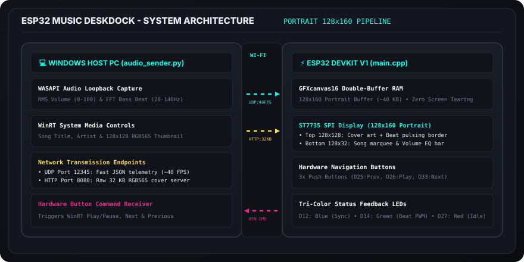

# ESP32 Music Deskdock

<p align="center">
  
</p>

An ESP32-based desktop music visualizer and media controller using a 1.8" ST7735 TFT display (128x160 portrait).

A Python script runs in the background on your Windows PC, captures playback audio via WASAPI loopback, extracts the current song title and album art using Windows Media APIs, and streams volume levels, beat detection, and metadata to the ESP32 over Wi-Fi. The ESP32 also features 3 hardware buttons for playback control (Play/Pause, Next, Previous).

---

## System Architecture

<p align="center">
  
</p>

- **UDP (`12345`)**: Streams real-time audio volume, bass beats, and song title to the ESP32 (~40 FPS). Also receives button inputs from the ESP32.
- **HTTP (`8080`)**: Serves raw 128x128 RGB565 album cover images (`/cover.raw`) when tracks change.

---

## Display Layout (128x160 Portrait)

<p align="center">
  
</p>

- **Top (128x128)**: Displays live album artwork with a pulsing border on bass beats.
- **Bottom (128x32)**: Horizontal scrolling song title, playback status (`►`), and volume equalizer bar.
- **Double-Buffered RAM**: All rendering happens in a 40 KB SRAM canvas (`GFXcanvas16`) before transferring over SPI to prevent screen flicker.

---

## Pinout & Wiring

| Component | Pin | ESP32 GPIO | Mode | Description |
| :--- | :--- | :--- | :--- | :--- |
| **ST7735 Display** | VCC | 3.3V | Power | 3.3V logic supply |
| | GND | GND | Ground | Common ground |
| | LED / BLK | 3.3V | Power | Backlight (connect to 3.3V) |
| | CS | GPIO 5 (D5) | Output | SPI Chip Select |
| | RST | GPIO 4 (D4) | Output | Display Reset |
| | A0 / DC | GPIO 2 (D2) | Output | Data / Command Select |
| | SDA / MOSI | GPIO 23 (D23) | SPI MOSI | Hardware VSPI Data |
| | SCK / SCL | GPIO 18 (D18) | SPI SCK | Hardware VSPI Clock |
| **Buttons** | Previous | GPIO 25 (D25) | `INPUT_PULLUP` | Previous Track (Active Low) |
| | Play/Pause | GPIO 26 (D26) | `INPUT_PULLUP` | Play / Pause (Active Low) |
| | Next | GPIO 33 (D33) | `INPUT_PULLUP` | Next Track (Active Low) |
| **LEDs** | Blue | GPIO 12 (D12) | Output | Wi-Fi Connected & Streaming |
| | Green | GPIO 14 (D14) | PWM Output | Beat Pulse Indicator |
| | Red | GPIO 27 (D27) | Output | Idle / Standby |

Detailed wiring notes can be found in [HARDWARE_PINOUT.md](HARDWARE_PINOUT.md).

---

## Quick Start

### 1. Flash the ESP32 Firmware
1. Open `src/main.cpp` and set your Wi-Fi credentials:
   ```cpp
   const char* ssid     = "YOUR_WIFI_SSID";
   const char* password = "YOUR_WIFI_PASSWORD";
   ```
2. Build and upload using PlatformIO:
   ```bash
   pio run --target upload
   ```
3. Open serial monitor (`pio device monitor`) to get the ESP32's local IP address (e.g. `192.168.1.51`).

### 2. Run the PC Transmitter
1. Install Python dependencies on Windows:
   ```bash
   pip install -r requirements.txt
   ```
2. Start the script:
   ```bash
   python audio_sender.py
   ```
3. Enter the ESP32 IP address when prompted. Play music in Spotify, YouTube, VLC, or your browser.

---

## Customization

To change display orientation, on-screen text, RGB565 theme colors, or animation speeds, see **[CUSTOMIZATION_GUIDE.md](CUSTOMIZATION_GUIDE.md)**.
