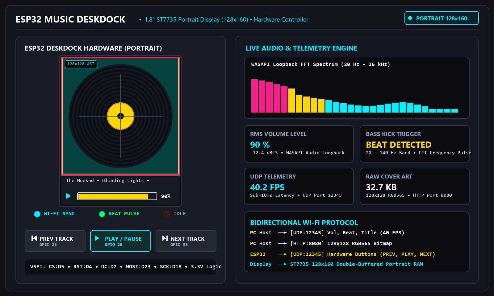
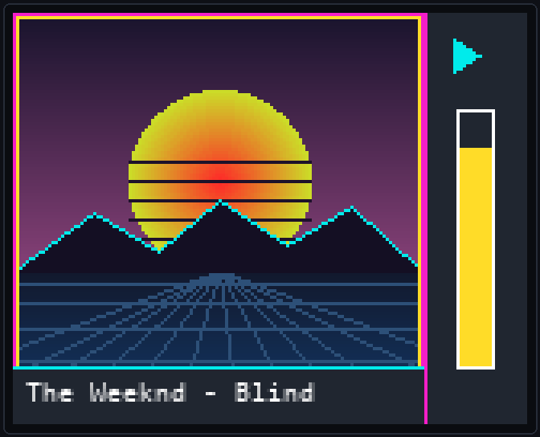

# ESP32 Music Deskdock - Live Album Cover & Audio Visualizer

<p align="center">
  
</p>

A real-time desktop music companion built with an **ESP32 DevKit V1** and a 1.8" ST7735 TFT display (160x128). The ESP32 pairs over Wi-Fi with a Python background app running on your Windows PC. 

The Python script captures desktop audio in real time, extracts volume levels and bass beats, pulls the currently playing track's title and album art (from Spotify, YouTube, Apple Music, VLC, browser tabs, etc.), and streams the telemetry to the ESP32. The ESP32 also features 3 hardware push buttons that allow you to control playback (Play/Pause, Next, Previous) directly from your desk.

---

## 🛠️ System Architecture

```
┌────────────────────────────────────────────────────────┐
│                   Windows Host PC                      │
│                                                        │
│  [ WASAPI Audio Loopback ] ──► RMS Vol & FFT Bass Beat │
│  [ Windows Media APIs    ] ──► Track Title & Cover Art │
│                                                        │
│  • UDP Port 12345: Sends fast volume & beat telemetry  │
│  • UDP Port 12345: Receives button control commands    │
│  • HTTP Port 8080: Serves raw 128x128 RGB565 cover art │
└───────────────────────────┬────────────────────────────┘
                            │ Wi-Fi Network
┌───────────────────────────▼────────────────────────────┐
│                    ESP32 DevKit V1                     │
│                                                        │
│  • 1.8" ST7735 Display (160x128 Double-Buffered RAM)   │
│    - Left (128x128): Album Art + Pulsing Beat Border   │
│    - Right (32px): Play/Pause Status & Volume Bar      │
│    - Bottom: Smooth scrolling song marquee             │
│  • 3x Navigation Buttons (Previous, Play/Pause, Next)  │
│  • 3x Status LEDs (Blue: Sync, Green: Beat, Red: Idle) │
└────────────────────────────────────────────────────────┘
```

---

## 📺 ESP32 Display Layout & UI Architecture

<p align="center">
  
</p>

The 1.8" ST7735 display runs in landscape mode (160×128 pixels) with a custom double-buffered RAM canvas (`GFXcanvas16`):
- **Left 128×128 Viewport**: Displays live 16-bit RGB565 album cover artwork with a dynamic pulsing neon double border (Neon Magenta outer & Gold Yellow inner) on bass kick beats.
- **Right 32px Side Panel**: Cyan playback indicator (`►`) and a solid vertical volume equalizer bar rising inside a white frame (Cyan normally, Yellow on beat).
- **Bottom 18px Marquee**: Smoothly scrolls long track names and artist metadata across the screen over a dark grey banner with a cyan top line.

---


## 📁 Project Structure

```text
├── .gitignore
├── platformio.ini               # PlatformIO build configuration
├── requirements.txt             # Python host dependencies
├── HARDWARE_PINOUT.md           # Pin mappings & wiring guide
├── README.md                    # Project documentation & architecture
├── audio_sender.py              # Windows PC WASAPI transmitter & controller
├── assets/
│   ├── deskdock_hero.gif        # Main hero preview animation
│   └── esp32_display_real.gif   # 1:1 ST7735 160x128 display UI emulator
└── src/
    └── main.cpp                 # ESP32 double-buffered firmware
```

---

## 📌 Hardware Pin Layout

| Component | Pin Function | ESP32 Pin | GPIO | Pin Mode | Description |
| :--- | :--- | :--- | :--- | :--- | :--- |
| **ST7735 TFT Display** | VCC | 3.3V | — | Power | Display power (3.3V) |
| | GND | GND | — | Ground | Ground |
| | LED / BLK | 3.3V | — | Power | Backlight anode |
| | CS | D5 | GPIO 5 | Output | SPI Chip Select |
| | RESET | D4 | GPIO 4 | Output | Hardware Reset |
| | A0 / DC | D2 | GPIO 2 | Output | Data / Command Selection |
| | SDA / MOSI | D23 | GPIO 23 | Hardware SPI | VSPI MOSI line |
| | SCK / SCL | D18 | GPIO 18 | Hardware SPI | VSPI Clock line |
| **Physical Buttons** | UP Switch | D25 | GPIO 25 | `INPUT_PULLUP` | **Previous Track** (Active Low) |
| | SELECT Switch | D26 | GPIO 26 | `INPUT_PULLUP` | **Play / Pause** (Active Low) |
| | DOWN Switch | D33 | GPIO 33 | `INPUT_PULLUP` | **Next Track** (Active Low) |
| **Status LEDs** | Blue LED | D12 | GPIO 12 | Output | Wi-Fi Connected & Streaming |
| | Green LED | D14 | GPIO 14 | PWM Output | Beat Pulse Indicator (Dimmed PWM) |
| | Red LED | D27 | GPIO 27 | Output | Idle / Disconnected / Paused |

For detailed electrical notes, see [HARDWARE_PINOUT.md](file:///c:/Users/Dhruv%20Saraswat/Documents/Projects/MUSIC/HARDWARE_PINOUT.md).

---

## ⚙️ Network & Ports Configuration

- **UDP Port (`12345`)**: Used for high-speed, low-latency audio telemetry (volume, beat trigger, song title) and for receiving button commands from the ESP32.
- **HTTP Port (`8080`)**: A lightweight Python HTTP server that serves the raw 32 KB RGB565 album cover image (`/cover.raw`) when a song changes.

---

## 🚀 Setup & Getting Started

### 1. Prerequisites & PlatformIO (PIO) Installation

You will need **PlatformIO** to compile and upload the ESP32 firmware. You can install it using either method:

#### Option A: Via VS Code (Recommended)
1. Open **Visual Studio Code**.
2. Open the Extensions tab (`Ctrl+Shift+X` on Windows/Linux or `Cmd+Shift+X` on macOS).
3. Search for **PlatformIO IDE** and click **Install**.
4. Restart VS Code once installation finishes.

#### Option B: Via PlatformIO Core (CLI)
Install the standalone CLI using Python's package manager:
```bash
pip install -U platformio
```

Verify your installation by checking the version:
```bash
pio --version
```

### 2. Configure Wi-Fi Credentials
Open [src/main.cpp](file:///c:/Users/Dhruv%20Saraswat/Documents/Projects/MUSIC/src/main.cpp#L45-L46) and update your Wi-Fi SSID and password:
```cpp
const char* ssid     = "YOUR_WIFI_SSID";
const char* password = "YOUR_WIFI_PASSWORD";
```

### 3. Upload ESP32 Firmware
Connect your ESP32 board via USB, then build and flash using PlatformIO:
```bash
pio run --target upload
```
Open the serial monitor (115200 baud) to monitor boot logs:
```bash
pio device monitor
```
Once connected, the ESP32 display will show its assigned IP address on your local network (e.g., `192.168.1.51`).

### 4. Install PC Python Dependencies
Install the required Python packages on your Windows PC:
```bash
pip install -r requirements.txt
```

### 5. Run the Python Audio Transmitter
Start playing music on your PC (Spotify, YouTube, VLC, browser, etc.), then start the script:
```bash
python audio_sender.py
```
When prompted, enter the IP address shown on the ESP32 screen. The script will automatically start capturing loopback audio, detecting beats, fetching album art, and listening for button presses.

---

## 🔍 Troubleshooting Tips

- **Windows Firewall**: When running `audio_sender.py` for the first time, Windows may ask for permission to allow Python to communicate on private networks. Allow access so the ESP32 can send UDP button commands and fetch album art over HTTP.
- **No Album Cover / Title**: Make sure the media player supports Windows System Media Transport Controls (Spotify, Chrome, Edge, and modern media players support this natively). If not supported, the system defaults to a retro vinyl disc graphic.
- **Audio Capture Device**: The script defaults to your primary Windows playback device via WASAPI loopback. If no sound is detected, ensure audio is actively playing through your default speakers/headphones.


